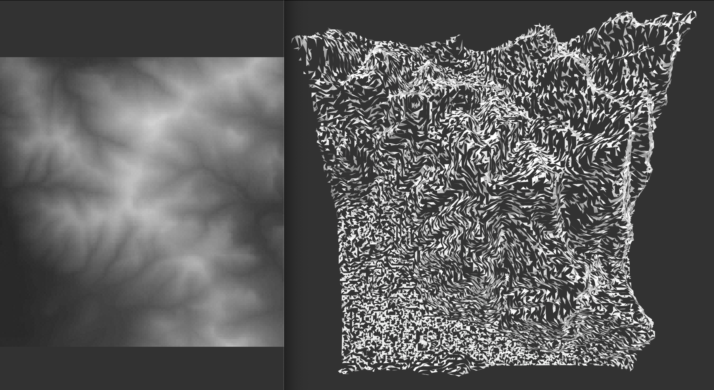

# GIS_Shortcuts

GIS from Bash, Python, and R    



* * *       

**GDAL for GIS on UNIX:  Using a Mac (or better, Linux)**

Bash is great: It is a shell scripting language that is baked into every new Apple computer and many, many Linux distributions too.  It is fun to learn and easy to find your “insert repetitive task here” to Bash translation on Stack Exchange, just a search away.  As you uses the command prompt more and more for increasingly cool GIS tasks- be it for Python QGIS OR ESRI, R language for data cleaning and analysis, or just because you noticed you can get “mad amounts of work done” at increasingly faster rates- your vocabulary in the UNIX shell and bash will naturally grow.  

I wanted to make a GIS post for Mac OS because it is both under-represented (for great reasons) in GIS and arguably the number 1 choice for any discerning consumers of computer hardware.   

Many Linux OS options are faster for much of this “UNIX for GIS”, as quite a few of the things we need are already included with many Debian / Ubuntu distros, and come forms that have been stable for a long, long time.  

If you are looking to setup a system primarily for GIS / data science (disregarding ESRI of course), See my initial notes on the Ubuntu variant Pop_OS by System76.  If you like the ChromeOS vibe for multitasking and simplicity and the familiarity of Mac OS, it is a keeper (and also a sleeper, seeing how many folks are still on Windows for GIS…….).  

**Open Terminal**
(The less you have in your way on your screen, the faster you can go!)  xD

Note: in my opinion, homebrew and macPorts are good ideas- try them!  If you don’t have it, get it now:
```
/usr/bin/ruby -e "$(curl -fsSL https://raw.githubusercontent.com/Homebrew/install/master/install)"
```
(….However, port or brew installing QGIS and GDAL (primarily surrounding the delicate links between QGIS / GDAL / Python 2 & 3 / OSX local paths) can cause baffling issues.  If possible, don’t do that.  Use QGIS installers from the official site and build from source!)

if you need to resolve issues with your GDAL packages via removal:
on MacPorts, try similar:
```
sudo port uninstall qgis py37-gdal

# on homebrew, list then remove (follow its instructions):

brew list
brew uninstall gdal geos gdal2  
```     
*!!! NOTE:  I am investigating more reliable built-from-source solutions for gdal on mac.*      

Really!

There are numerous issues with brew-installed gdal.  Those I have run into include:
- linking issues with the crucial directory “gdal-data” (libraries)
- linking issues Python bindings and python 2 vs. 3 getting confused
- internal raster library conflicts against the gdal requirements
- Proj.4 inconsistencies (see source notes below)
- OSX Framework conflicts with source / brew / port (http://www.kyngchaos.com/software/frameworks/)
- Linking conflicts with old, qgis default / LTR libraries against new ones
- Major KML discrepancies: expat standard vs libkml.  
```
brew install gdal
#
# brew install qgis can work well too.  At least you can unbrew it!
#
```

Next, assuming your GDAL is not broken (on Mac OS this is rare and considered a miracle):

```
# double check CLI is working:
gdalinfo --version
# “GDAL 2.4.0, released 2018/12/14”
gdal_merge.py
# list of args
```

# Using Ubuntu GDAL on Windows w/ WSL   

[LINK: get the WSL shell from Microsoft](https://docs.microsoft.com/en-us/windows/wsl/install-win10)

```
# In the WSL shell:

sudo apt-get install python3.6-dev -y
sudo add-apt-repository ppa:ubuntugis/ppa && sudo apt-get update
sudo apt-get install libgdal-dev -y
sudo apt-get install gdal-bin -y

# See here for more notes including Python bindings:
# https://mothergeo-py.readthedocs.io/en/latest/development/how-to/gdal-ubuntu-pkg.html
```     

# In a new Shell:   

```
# Double check the shell does indeed have GDAL in $PATH:
gdalinfo --version

```

***To begin- try a recent GIS assignment that relies on the ESRI mosaic system and lots of GUI and clicking but use GDAL instead.***

Data source: ftp://ftp.granit.sr.unh.edu/pub/GRANIT_Data/Vector_Data/Elevation_and_Derived_Products/d-elevationdem/d-10m/

!!  Warning!  These files are not projected in a way ESRI or GDAL understands.  They WILL NOT HAVE A LOCATION IN QGIS.  They will, however, satisfy the needs of the assignment.     

```
# wget on mac is great.  This tool (default on linux) lets us grab GIS data from
# most providers, via FTP and similar protocols.

brew install wget
```
make some folders
```
mkdir GIS_Projects && cd GIS_Projects
```
use wget to download every .dem file (-A .dem) from the specified folder and sub-folders (-r)
```
wget -r -A .dem ftp://ftp.granit.sr.unh.edu/pub/GRANIT_Data/Vector_Data/Elevation_and_Derived_Products/d-elevationdem/

cd ftp.granit.sr.unh.edu/pub/GRANIT_Data/Vector_Data/Elevation_and_Derived_Products/d-elevationdem
```
make an index file of only .dem files.  
(If we needed to download other files and keep them from our wget (more common)
this way we can still sort the various files for .dem)
```
ls -1 *.dem > dem_list.txt
```
use gdal to make state-plane referenced “Output_merged.tif” from the list of files
in the index we made.
it will use a single generic "0 0 255" band to show gradient.  

```
gdal_merge.py -init "0 0 255" -o Output_Merged.tif --optfile dem_list.txt
```
copy the resulting file to desktop, then return home
```
cp Output_Merged.tif ~/desktop && cd
```
if you want (recommended):
```
rm -rf GIS_Projects  # remove .dem files.  Some are huge!
```
In Finder at in ~/desktop, open the new file with QGIS.  A normal photo viewer will NOT show any detail.  

Need to make something like this a reusable script?  In Terminal, just a few extra steps:
```
mkdir GIS_Scripts && cd GIS_Scripts
```
open an editor + filename.  Nano is generally pre-installed on OSX.
```
nano GDAL_LiveMerge.sh
```
COPY + PASTE THE SCRIPT FROM ABOVE INTO THE WINDOW
 - ctrl+X , then Y for yes

make your file runnable:
```
chmod u+x GDAL_LiveMerge.sh
```
run with ./
```
./GDAL_LiveMerge.sh
```     

You can now copy + paste your script anywhere you want and run it there.  scripts like this should not be exported to your global path / bashrc and will only work if they are in the directory you are calling them:  If you need a global script, there are plenty of ways to do that too.

*See /Notes_GDAL/README.md for notes on building GDAL from source on OSX*

  


# :)
